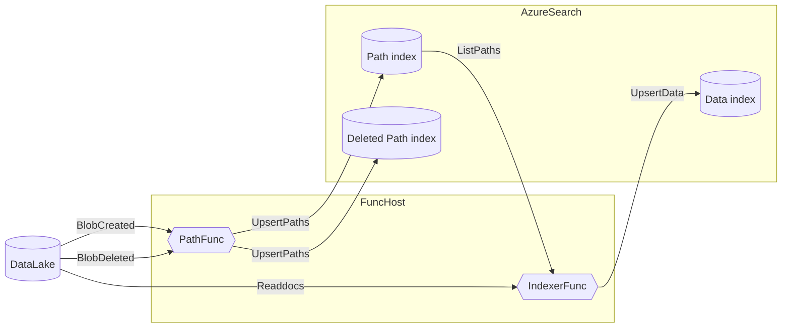

# AzureDataLakeIndexer
Azure Datalake gen2 search indexer fiddling
The reason this exists, is because the built in datalake indexers in azure search are slow... mind numbingly slow. 
Most of the time the indexers seem to spend on listing paths in datalake and this project solves this by using a helper index for paths. Querying this index for modified files is much faster than listing paths in datalake
The built in indexers also has a habit of forgetting to renew the access tokens even when using RBAC causing indexing to fail.

## Overview

